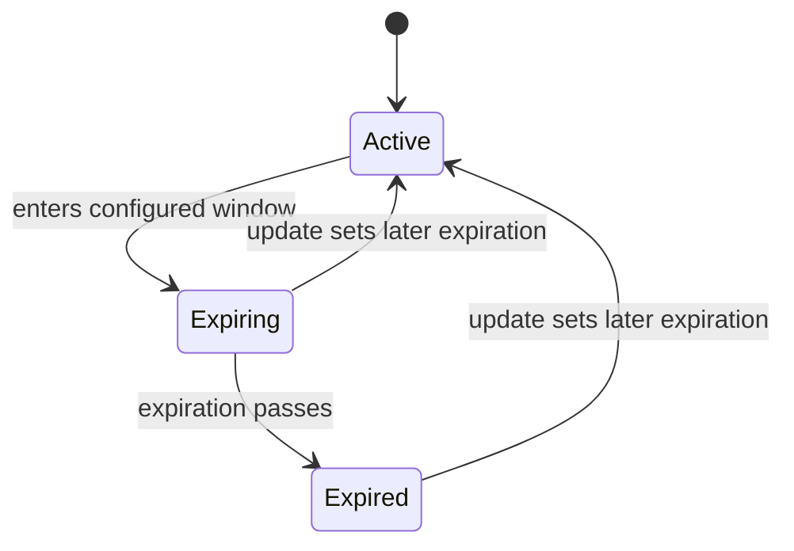
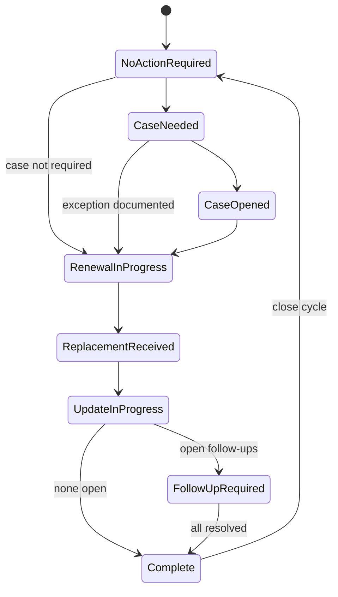

# Certificate Lifecycle

Certificate time health and renewal work are separate. A certificate can be **Expiring** while work is **Replacement Received**.

## Derived expiration health

| Health | Derivation |
|---|---|
| Active | Expiration is after the configured expiring window. |
| Expiring | Expiration is today or within the future threshold. |
| Expired | Expiration is before today. |

Health is calculated, not authoritative stored state. Threshold and business timezone are open. Inactive/retired inventory disposition, if needed, is a separate field.

## Operational renewal status

| State | Meaning | Typical next states |
|---|---|---|
| No Action Required | No active work | Case Needed, Renewal In Progress |
| Case Needed | External case is needed | Case Opened, Renewal In Progress |
| Case Opened | Case reference exists | Renewal In Progress |
| Renewal In Progress | Replacement is being obtained/planned | Replacement Received, Update In Progress |
| Replacement Received | Replacement facts are available | Update In Progress |
| Update In Progress | Guided recording underway | Follow-up Required, Complete |
| Follow-up Required | Update completed with open follow-ups | Complete |
| Complete | Update event complete with no open follow-ups | No Action Required |

Before event completion, planning states may move backward. Completed events are not reopened; correction policy is open.

## Completion rules

Completion is blocked by missing/invalid replacement facts, unanswered required guidance, unaccounted environment outcomes, or absent review confirmation. Open follow-ups and an absent case do **not** block completion when explicitly acknowledged and allowed by policy. Completion atomically records history, updates current facts, stores guidance snapshots, and creates follow-ups.

## Open decisions

- Expiring threshold and business timezone.
- When a support case is mandatory.
- Correction permissions and event correction method.
- Whether Complete immediately normalizes to No Action Required.
