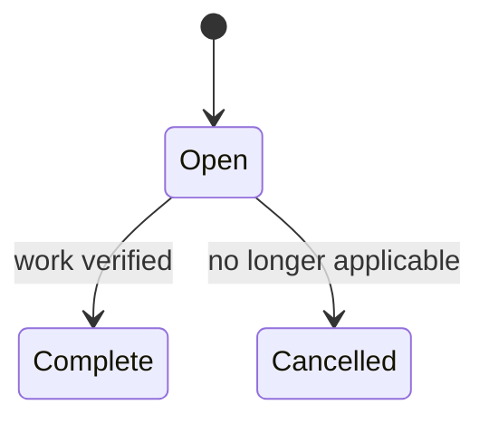

# Follow-up Actions

Follow-ups record unfinished work without preventing an otherwise valid certificate update from completing.

## Creation and fields

Users may create multiple actions during guidance, cleanup, environment completeness, or review. Guidance may prefill text, but users review it.

| Field | Rule |
|---|---|
| Description | Required plain operational action. |
| Status | Open, Complete, Cancelled; defaults Open. |
| Certificate update | Required; establishes immutable origin and certificate. |
| Created time/identity | Required audit metadata. |
| Due date | Optional date; overdue is derived and does not imply an SLA. |
| Terminal time/note | Timestamp required at completion/cancellation; note policy open. |
| Support case | Optional case from the originating update. |
| Assignee | Not required; Support owns work as a team. |

Terminal actions remain in history. Reopening is excluded; create a new linked action if work re-emerges. Resolving the last open action permits operational status to move from Follow-up Required to Complete.

Open actions appear in the shared Support queue and certificate detail. Audit identity does not transfer team ownership. Update review lists all actions and permits completion with them open. Invalid action content blocks that action, not unrelated completion, unless policy requires an action for the selected guidance response.

## Open decisions

- User-entered versus guidance-suggested due dates.
- Mandatory completion/cancellation notes.
- Whether later manual action creation and notifications are MVP.
