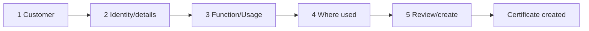

# Add Certificate Flow

The Add wizard is intentionally short. A persistent step indicator announces the current step; each page has one `h1`, one primary question, labeled controls, an error summary, and Back/Continue controls in predictable order. Back always preserves accepted and currently entered values. WP-004 implements this as a typed, serializable DTO held in the HTTP session; no JPA entity is stored in session and nothing is persisted before final confirmation. Start, Cancel, and successful completion clear the wizard state.



## 1 — Customer

- **Purpose/question:** “Which customer is this certificate for?”
- **Controls:** active-customer native selection with browser type-to-select behavior; no inline customer creation in MVP.
- **Validation:** one active customer required.
- **Behavior:** selection controls valid sites later; Continue saves draft; Back returns to origin.
- **Accessibility:** native label/instructions, keyboard-operable results, result count/status announced.

```text
┌ ADD CERTIFICATE · STEP 1 OF 5 ───────────────┐
│ Which customer is this certificate for?      │
│ Customer [ Search or select...             ] │
│                              [Continue]       │
└──────────────────────────────────────────────┘
```

## 2 — Certificate identity/details

- **Purpose/question:** “What certificate are we tracking?”
- **Controls:** name, type, issuer, expiration date, optional notes. Fingerprint/serial fields await product decision.
- **Validation:** required name/type/valid date; issuer and the remaining metadata are optional; duplicate policy remains open.
- **Behavior:** no conditional fields in MVP; Back preserves values; Continue validates and saves draft.
- **Accessibility:** date format/help is explicit and errors link to fields.

```text
┌ STEP 2 OF 5 · WHAT CERTIFICATE? ─────────────┐
│ Name [________________]  Type [___________▼] │
│ Issuer [______________]  Expires [________]  │
│ Notes [___________________________________]  │
│ [Back]                              [Continue]│
└──────────────────────────────────────────────┘
```

## 3 — Function / Usage

- **Purpose/question:** “What does this certificate do?”
- **Controls:** multi-select controlled Function / Usage values.
- **Validation:** at least one value is required.
- **Behavior:** Other may reveal a labeled explanation only if governed; Back preserves; Continue stores selections.
- **Accessibility:** checkbox group with `fieldset`/`legend`, not a keyboard-hostile custom picker.

```text
┌ STEP 3 OF 5 · WHAT DOES IT DO? ──────────────┐
│ [ ] Application  [ ] Integration  [ ] API    │
│ [ ] Authentication [ ] Web/TLS [ ] Other     │
│ [Back]                              [Continue]│
└──────────────────────────────────────────────┘
```

## 4 — Where used

- **Purpose/question:** “Where is this certificate used?”
- **Controls:** systems/integrations, environments, hostnames, and affected sites filtered to the selected customer.
- **Validation:** normalized valid hostname syntax; active sites must belong to the selected customer; set-backed inputs collapse duplicate selections. Location context remains optional.
- **Behavior:** add/remove multiple values; changing customer after this step warns and clears only incompatible sites after confirmation.
- **Accessibility:** each collection has an accessible name; add/remove actions announce results and remain operable without drag-and-drop.

```text
┌ STEP 4 OF 5 · WHERE USED? ───────────────────┐
│ Systems [ OMS × ] [+ Add]                    │
│ Environments [✓ Production] [✓ Staging]      │
│ Hostnames [ app.example.org × ] [+ Add]      │
│ Sites [ North × ] [+ Add]                    │
│ [Back]                              [Continue]│
└──────────────────────────────────────────────┘
```

## 5 — Review and create

- **Purpose/question:** “Is this certificate information correct?”
- **Controls:** grouped read-only summary, Edit links to each step, Create Certificate.
- **Validation:** all required data is revalidated; stale reference selections block with an actionable message.
- **Behavior:** Edit/Back preserves draft; Create is one idempotent submission and redirects to detail with confirmation.
- **Accessibility:** summary uses headings/definition lists; errors and success are announced; focus moves to error summary or confirmation.

```text
┌ STEP 5 OF 5 · REVIEW ────────────────────────┐
│ Customer … [Edit]  Certificate … [Edit]      │
│ Usage … [Edit]     Where used … [Edit]       │
│ [Back]                    [Create Certificate]│
└──────────────────────────────────────────────┘
```

## Open decisions

Duplicate-certificate warning/block behavior, draft timeout/cross-tab behavior, abandonment analytics, and permitted inline reference-data requests.
