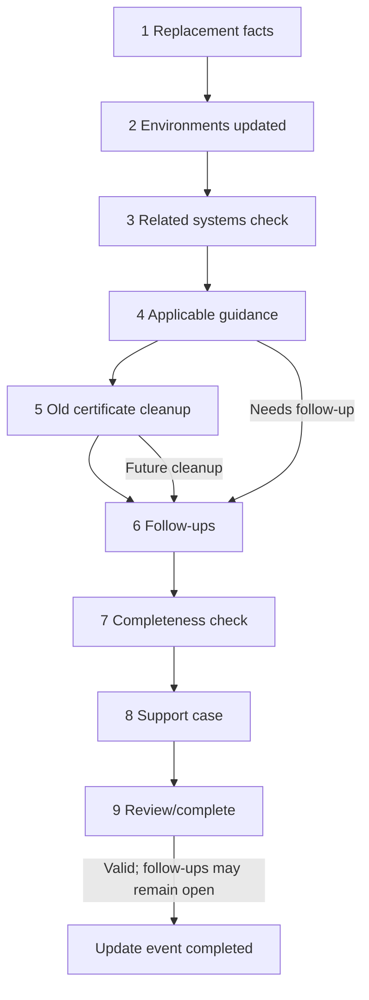

# Update / Replace Certificate Flow

This guided flow records a replacement event and actively checks relevant dependencies. It does not deploy certificates. Draft state preserves entries through Back navigation and branching.

## Screen contract

| Step | Primary question | Controls and validation | Conditional/navigation behavior |
|---|---|---|---|
| 1 Replacement facts | What replacement certificate are you recording? | New expiration required and later than applicable prior date; update/replace type; issuer changed; optional notes. Identity fields await governance. | Issuer change becomes a guidance fact. Back returns to detail; Continue begins/updates draft. |
| 2 Environments | Which environments were updated? | Each currently associated environment gets Updated, Not updated, or Not applicable plus explanation where required; additional selected environment validated. | Multiple environments becomes a trigger fact. Every expected environment must be accounted for. |
| 3 Related systems | Which related systems or services were checked? | Existing systems listed with checked/updated, needs follow-up, or not applicable; changes to relationships are explicit. | Needs follow-up proposes an action; relationship edits affect guidance after confirmation. |
| 4 Adaptive guidance | What remaining operational checks apply? | One applicable prompt at a time; required controlled response and optional note. | Only active/effective matching rules appear. Back restores response; changing trigger facts re-evaluates and warns before removing draft responses. |
| 5 Old certificate cleanup | Does the previous certificate need to be removed? | No, Already removed, Needs follow-up, Not applicable; environment/context and note when relevant. | For Staging cleanup, Needs follow-up proposes “Remove previous certificate from Staging.” |
| 6 Follow-ups | What work still needs to be completed? | Add/edit/remove multiple draft actions; description required, due date optional, case optional. | Includes proposals from systems, guidance, and cleanup; user reviews each. |
| 7 Completeness | Have all expected environments and consumers been accounted for? | Summary of updated/not updated/not applicable outcomes; explicit acknowledgement of gaps. | Unanswered outcomes block; acknowledged gaps become follow-ups or documented exceptions according to open policy. |
| 8 Support case | Is there a Support case for this update? | Yes/No; if Yes, required case number, optional system and URL; multiple cases permitted. | No is recorded and does not inherently block; mandatory-case policy is open. |
| 9 Review | Is this update ready to complete? | Read-only before/after facts, outcomes, guidance/responses, cases, open follow-ups; Edit links; confirmation. | Completion is idempotent; success redirects to history/detail. |

Every screen uses semantic headings, `fieldset`/`legend` for response groups, visible focus, error summary links, announced dynamic changes, keyboard/mouse parity, and no color-only status. Back preserves all entered values.

## OMS example

When `System / Integration = OMS`, an applicable rule may ask:

> Did you also check OMS Integration?

- **Yes — checked / updated as needed:** snapshot response; no action suggested.
- **Needs follow-up:** snapshot response and prefill `Verify OMS Integration` for review.
- **Not applicable:** snapshot response; optional/required explanation policy remains open.

## Staging cleanup example

If Staging is associated or was updated, cleanup asks “Does the previous certificate need to be removed?” Choosing Needs follow-up can create `Remove previous certificate from Staging` as future Support work.

## Completion boundary and history

Completion is blocked by invalid replacement facts, unanswered required guidance, unaccounted expected environment/system outcomes, invalid follow-up data selected for creation, or missing review confirmation. Open follow-ups and a documented absence of a case do not block completion unless a later governed policy makes the case mandatory.

Completion atomically stores a `CertificateUpdate` snapshot (previous/new expiration, issuer-change, user/time, environments, systems outcomes, case references, guidance snapshots/responses, notes, follow-ups) and updates current Certificate facts. The result is `Follow-up Required` when actions remain Open, otherwise `Complete`.

## Open decisions

Case-mandatory rules, explanation requirements, exact environment/system outcome vocabulary, update draft expiry/concurrency, identity fields for replacement, correction policy, and whether relationship changes occur inside this wizard.
