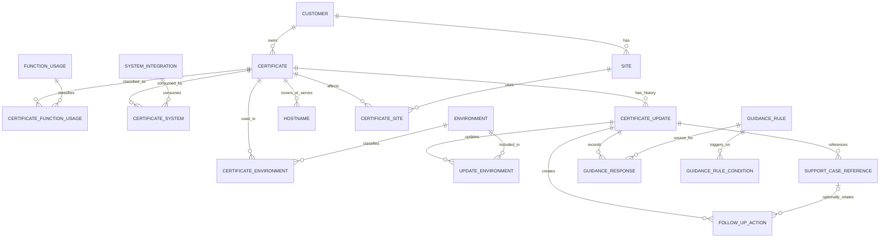

# Governed Logical Data Model Proposal

**Status:** Proposed for product-owner review. This governs logical design only; WP-002 creates no domain schema or JPA entities.

## Design decisions

1. A certificate is stored once. Sites, hostnames, environments, functions, and systems are related context, never duplicate certificate records.
2. `Certificate` is the current authoritative inventory record. Each completed renewal or replacement creates an immutable `CertificateUpdate` event preserving prior and new facts.
3. Expiration health is derived from the current expiration date; operational renewal state is stored separately.
4. Product/Application/Interface are replaced in MVP by multi-valued `FunctionUsage` (what role) and `SystemIntegration` (which named consumer).
5. Guidance responses snapshot what was shown and answered; later rule edits never rewrite history.

## Logical ERD

`CERTIFICATE_*` junctions implement logical many-to-many relationships. Hostname is an owned child entity because normalization, constraints, lifecycle, and future audit matter; JPA `@ElementCollection` would obscure identity and change tracking. A global shared Hostname entity is unnecessary until shared identity is proven useful.

## Entity catalog

| Entity | Purpose and important attributes | Relationships/cardinality | Ownership/lifecycle | Data kind |
|---|---|---|---|---|
| Customer | Agency identity; stable ID, display name, active flag, audit metadata | 1 to many Certificates and Sites | Managed reference; master source open | Reference |
| Certificate | Current record; ID, name, customer, type, issuer, expiration, renewal status, notes, audit metadata | Exactly 1 Customer and Type; 0..* functions, systems, environments, hostnames, sites, updates | Created through Add; current facts updated in place; never duplicated per consumer | Transactional/current |
| Certificate Type | Controlled purpose/form such as TLS/SSL, Client Authentication, Signing, SAML, Other | 1 to many Certificates | Admin-maintained; final values open | Reference |
| Function Usage | Role served, such as Integration, Authentication, API, Web/TLS | Many to many Certificates | Controlled vocabulary | Reference |
| System Integration | Named consumer such as OMS, OMS Integration, JNET | Many to many Certificates; usable in guidance | Admin-maintained; source/aliases open | Reference |
| Environment | Production, Staging, Test, DR, Other | Many to many Certificates and Updates | Small controlled vocabulary | Reference |
| Hostname | Normalized FQDN/hostname, display value, active flag, audit metadata | Exactly 1 Certificate in MVP; Certificate has 0..* | Owned child; update snapshots preserve historical context | Transactional child |
| Site | Customer installation; ID, customer, name/code, active flag | Exactly 1 Customer; many to many Certificates | Customer-owned reference; master source open | Reference |
| Certificate Update | Renewal/replacement event; previous/new expiration, type, time/user, issuer-changed flag, notes, outcome | Exactly 1 Certificate; 0..* environments, cases, responses, follow-ups | Draft in wizard; immutable after completion except governed correction | Historical transaction |
| Update Environment | Environment outcome at event completion | Exactly 1 Update and Environment | Immutable event snapshot | Historical child |
| Support Case Reference | External system, case number, optional URL, linked date | Exactly 1 Update; 0..* per Update; optional link from Follow-up | Retained with history; no ticket workflow | Historical reference |
| Follow-up Action | Unfinished work; description, status, timestamps, optional due date, terminal note | Exactly 1 Update and thus 1 Certificate; optional case | Open to Complete/Cancelled; retained historically | Transactional |
| Guidance Rule | Configurable knowledge; stable ID, name, status, priority, prompt, explanation, responses, follow-up template, effective dates, audit metadata | 1..* conditions; 0..* responses | Admin-managed, versioned, retired rather than overwritten | Reference/configuration |
| Guidance Rule Condition | Narrow fact/operator/value trigger | Exactly 1 Rule; conditions combine with AND | Managed with rule version | Reference/configuration |
| Guidance Response | Snapshot of rule/version, prompt, options, selected response, time/user, follow-up outcome | Exactly 1 Update and normally 1 source Rule | Immutable even when rule changes | Historical child |

Exact SQL types, keys, soft-delete policy, and concurrency fields belong to physical design.

## Cardinality and integrity rules

- Customer `1 — 0..*` Certificate and Site; each Certificate and Site has exactly one Customer.
- Certificate `0..* — 0..*` Function Usage, System Integration, Environment, and Site via explicit junctions.
- Certificate `1 — 0..*` owned Hostname and Certificate Update.
- Certificate Update `1 — 0..*` Follow-up, Guidance Response, Support Case Reference, and Update Environment.
- Guidance Rule `1 — 1..*` Condition and `1 — 0..*` Response.
- Certificate–Site relationships require matching Customer; duplicate junction rows are prohibited.

## Support case recommendation

Store zero or more lightweight case references on each `CertificateUpdate`, not one mutable case on Certificate. This preserves different cases across renewals and permits a replacement/reopened case without modeling ServiceNow. Certificate detail can derive the latest case from current work. Follow-ups may reference one case from their update.

Minimum fields are external system/type, case number, optional safe URL, and linked timestamp. Exclude comments, assignee, SLA, incident state, and ticket workflow.

## Certificate update recommendation

Use a dedicated event. Completion snapshots previous/new expiration, issuer-change fact, updated environment outcomes, case references, guidance shown/answered, follow-ups, notes, time, and user. Current Certificate facts and relationships change in the same transaction. This prevents expiration updates from destroying historical context.

## Product/Application/Interface recommendation

Replace all three overlapping fields:

- **Function / Usage:** multi-select controlled roles describing what the certificate does.
- **System / Integration:** multi-select named consumers describing where it is used.

Do not retain Product unless stakeholders prove an independent product hierarchy used for reporting, authorization, or ownership. If validated later, Product should be a parent/reference dimension related to systems, not another free-text Certificate field.

## Alternatives considered

| Alternative | Decision and rationale |
|---|---|
| Certificate per site | Rejected: duplicates identity/expiration and creates inconsistent history. |
| Mutable current case on Certificate | Rejected: loses update-specific history. |
| Update fields only on Certificate | Rejected: overwrites the audit trail. |
| Hostname `@ElementCollection` | Rejected: weaker identity, constraints, and audit evolution. |
| Globally shared Hostname many-to-many | Deferred: complexity without a proven MVP need. |
| General-purpose rules engine | Rejected: bounded certificate-fact conditions cover known reminders. |

## Open decisions before physical schema

1. Customer/site system of record, identifiers, synchronization, and inactive policy.
2. Certificate identity: fingerprint, serial, subject/SANs, issuer normalization, and duplicate rules.
3. Whether binaries/attachments are prohibited, linked externally, or separately secured.
4. Expiring threshold, timezone/date boundaries, and possible variations.
5. Final controlled vocabularies and administrators.
6. User identity source, correction policy, retention, and audit export.
7. Whether active renewal needs a separate work-item entity; MVP can initially store operational status on Certificate and create the historical event at completion.
